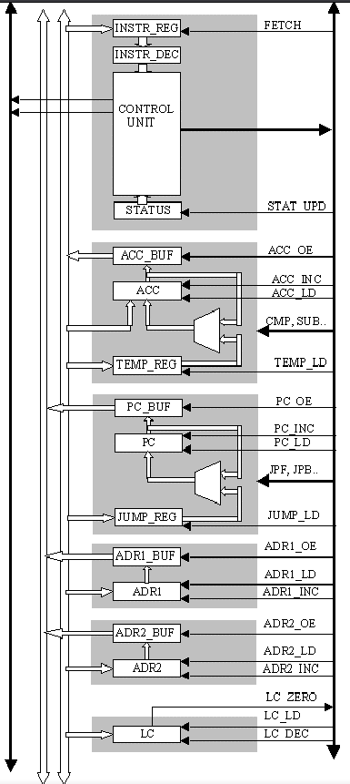
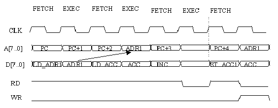
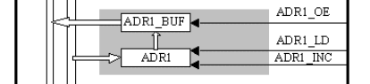

# Microprocessor 8bit with VHDL



## Submodules

- Control Unit (CU)
- Arithmetic Logic Unit (ALU)
- Program Counter (PC)
- Address Register
- Loop Counter

## Operations

All operations are performed in two clock cycles:

1. **FETCH:** The microprocessor loads an instruction from the memory location pointed by the Program Counter (PC). The instruction is stored in the Instruction Register (INSTR_REG), and then decoded by the Instruction Decoder.

2. **EXECUTE:** The Control Unit (CU) submits command execution to submodules with control signals.

## Instruction Set Architecture (ISA)

The instruction set supports the following operations:

- Memory-related operations (loading and storing of internal registers)
- Jump operations and address modifications
- Arithmetic and logic operations

### Instructions
| Instruction | Description | Operation |
| ----------- | ----------- | --------- |
| LD_ADDR1    | Loads address register 1 | ADR1 <= MEM(PC+1) |
| LD_ADDR2    | Loads address register 2 | ADR2 <= MEM(PC+1) |
| LD_ACC      | Loads accumulator | ACC <= MEM(ADR1) |
| LD_TEMP     | Loads temporary register | TEMP <= MEM(ADR2) |
| LD_JUMPREG  | Loads JUMP-register | JUMP_REG <= MEM(PC + 1) |
| ST_ACC1     | Store accumulator | MEM(ADR1) <= ACC |
| ST_ACC2     | Store accumulator | MEM(ADR2) <= ACC |
| JPF         | Unconditional jump forward | PC <= PC + JUMP_REG |
| JPB         | Unconditional jump back | PC <= PC - JUMP_REG |
| JPF_G       | Conditional jump forward if GT | PC <= PC + JUMP_REG if GT |
| JPF_Z       | Conditional jump forward if Z | PC <= PC + JUMP_REG if Z |
| CMP         | Compare | (GT, Z) <= ACC - TEMP |
| ADD         | Addition | ACC <= ACC + TEMP |
| SUB         | Subtraction | ACC <= ACC - TEMP |

### Instruction format
Single byte instruction
| OP code | function | mnemonic |
| - | - | - |
| 0000 | 0001 | CMP |
| 0000 | 0010 | ADD |
| 0000 | 0011 | SUB |
| 0001 | 0000 | JPF | 
| 0001 | 0001 | JPB | 
| 0001 | 0010 | JPF_G |
| 0001 | 0011 | JPF_Z |
| 1000 | 0001 | ST_ACC1 |
| 1000 | 0010 | ST_ACC1 |
| 1010 | 0000 | LD_ACC |
| 1010 | 0001 | LD_TEMP |

Two bytes instruction
| OP code | function | address | mnemonic |
|-|-| - | - |
| 1010 | 1000 | xxxxxxxx | LD_JUMPREG |
| 1010 | 1001 | xxxxxxxx | LD_ADDR1 |
| 1010 | 1010 | xxxxxxxx | LD_ADDR2 |



# Test Programs
`A=B+C`
How it would be "compiled"
```asm
; load the operands
LD_ADDR1 $B; load the address of B in the ADDR1
LD_ADDR2 $C; load the address of C in the ADDR2
; move the data in in ACC and TEMP
LD_ACC
LD_TEMP
; load the address of A in ADDR1
LD_ADDR1 $A;
ADD ;
ST_ACC1 ; store in memory the value of the ACC register
```

`IF A>=0 THEN B=C`
```asm
LD_ADDR1 $A ; load the address of A in the ADDR1
```

# List of signals
| Signal    | Meaning           | Units involved                  |
| --------- | ----------------- | ------------------------------- |
| FETCH     | Fetch signal      | Control bus -> CU (INSTR_REG)          |
| STAT_UPD  | Status update     | Control bus -> CU(STATUS) |
| ACC_OE    | Accumulator output enable | CU -> Control bus -> Accumulator(ACC_BUF) |
| ACC_INC   | Accumulator increment   | CU -> Control bus -> Accumulator(ACC) |
| ACC_LD    | Accumulator load        | CU -> Control bus -> Accumulator(ACC) |
| CMP       | Compare operation       | CU -> Control bus -> Accumulator(ALU) |
| SUB       | Subtraction operation   | CU -> Control bus -> Accumulator(ALU) |
| TEMP_LD   | Temporary register load | CU -> Control bus -> Accumulator(TMP_REG) |
| PC_OE     | Program counter output enable | CU -> Control bus -> ProgramCounter(PC_BUF) |
| PC_INC    | Program counter increment | CU -> Control bus -> ProgramCounter(PC) |
| PC_LD     | Program counter load | CU -> Control bus -> ProgramCounter(PC) |
| JPF       | Jump forward        | CU -> Control bus -> ProgramCounter(ALU) |
| JPB       | Jump backward       | CU -> Control bus -> ProgramCounter(ALU) |
| JUMP_LD   | Jump load address   | CU -> Control bus -> ProgramCounter(JUMP_REG) |
| ADDR1_OE  | Address 1 output enable | CU -> Control bus -> Register1(ADDR1_BUF) |
| ADDR1_INC | Address 1 increment     | CU -> Control bus -> Register1(ADDR1) |
| ADDR1_LD  | Address 1 load          | CU -> Control bus -> Register1(ADDR1)  |
| ADDR2_OE  | Address 2 output enable | CU -> Control bus -> Register2(ADDR2_BUF)  |
| ADDR2_INC | Address 2 increment     | CU -> Control bus -> Register2(ADDR2)  |
| ADDR2_LD  | Address 2 load          | CU -> Control bus -> Register2(ADDR2)  |

# Registers
<br>

Since the LD_ADDR* instructions are 2 bytes instructions, this is how they should work.
1. Instruction LD_ADDR is fetched and decoded. ADD_LD signal is sent by the CU
2. On the *Data bus* the address is loaded in ADDR*
3. On the EXEC clk iteration the address is sent to ADDR*_BUF. The CU sends a signal of ACC_OE and the address is released in the *Address bus*