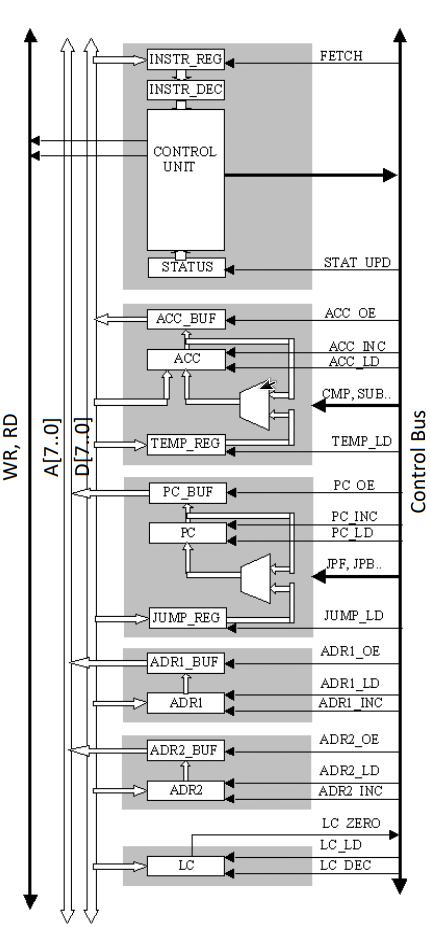

# Microprocessor 8bit with VHDL

## Submodules

- Control Unit (CU)
- Arithmetic Logic Unit (ALU)
- Program Counter (PC)
- Address Register
- Loop Counter

## Operations

All operations are performed in two clock cycles:

1. **FETCH:** The microprocessor loads an instruction from the memory location pointed by the Program Counter (PC). The instruction is stored in the Instruction Register (INSTR_REG), and then decoded by the Instruction Decoder.

2. **EXECUTE:** The Control Unit (CU) submits command execution to submodules with control signals.

## Instruction Set Architecture (ISA)

The instruction set supports the following operations:

- Memory-related operations (loading and storing of internal registers)
- Jump operations and address modifications
- Arithmetic and logic operations

### Instructions
| Instruction | Description | Operation |
| ----------- | ----------- | --------- |
| LD_ADDR1    | Loads address register 1 | ADR1 <= MEM(PC+1) |
| LD_ADDR2    | Loads address register 2 | ADR2 <= MEM(PC+1) |
| LD_ACC      | Loads accumulator | ACC <= MEM(ADR1) |
| LD_TEMP     | Loads temporary register | TEMP <= MEM(ADR2) |
| LD_JUMPREG  | Loads JUMP-register | JUMP_REG <= MEM(PC + 1) |
| ST_ACC1     | Store accumulator | MEM(ADR1) <= ACC |
| ST_ACC2     | Store accumulator | MEM(ADR2) <= ACC |
| JPF         | Unconditional jump forward | PC <= PC + JUMP_REG |
| JPB         | Unconditional jump back | PC <= PC - JUMP_REG |
| JPF_G       | Conditional jump forward if GT | PC <= PC + JUMP_REG if GT |
| JPF_Z       | Conditional jump forward if Z | PC <= PC + JUMP_REG if Z |
| CMP         | Compare | (GT, Z) <= ACC - TEMP |
| ADD         | Addition | ACC <= ACC + TEMP |
| SUB         | Subtraction | ACC <= ACC - TEMP |

### Instruction format
Single byte instruction
| OP code | function | mnemonic |
| - | - | - |
| 0000 | 0001 | CMP |
| 0000 | 0010 | ADD |
| 0000 | 0011 | SUB |
| 0001 | 0000 | JPF | 
| 0001 | 0001 | JPB | 
| 0001 | 0010 | JPF_G |
| 0001 | 0011 | JPF_Z |
| 1000 | 0001 | ST_ACC1 |
| 1000 | 0010 | ST_ACC1 |
| 1010 | 0000 | LD_ACC |
| 1010 | 0001 | LD_TEMP |

Two bytes instruction
| OP code | function | address | mnemonic |
|-|-| - | - |
| 1010 | 1000 | xxxxxxxx | LD_JUMPREG |
| 1010 | 1001 | xxxxxxxx | LD_ADDR1 |
| 1010 | 1010 | xxxxxxxx | LD_ADDR2 |

